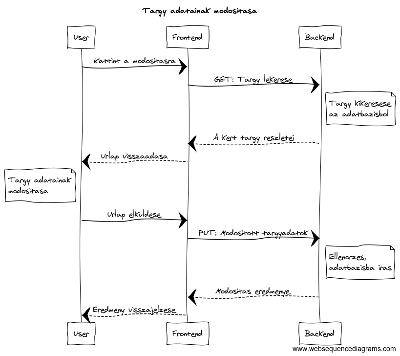
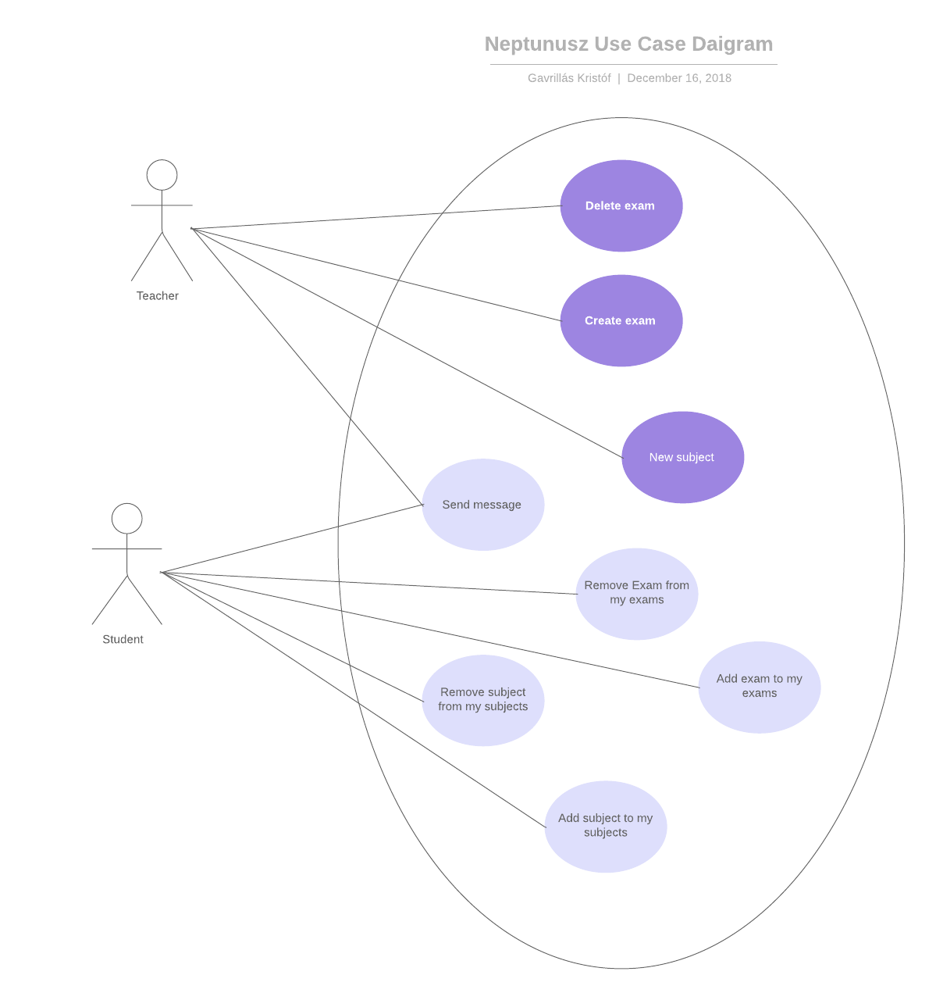
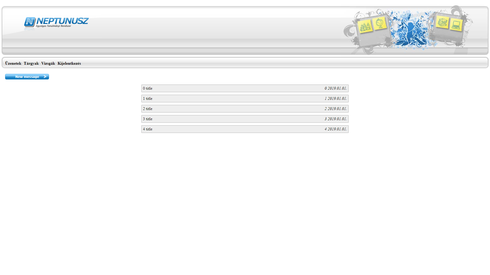
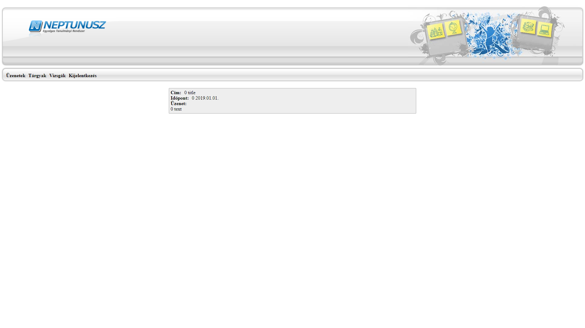

# Alkalmazasok fejlesztese - Neptunusz

## 0. Bevezeto
Ez a program egy felsooktatasi internetes tanulmanyi rendszer.
Lehetoseg van targyak es vizsgak felvetelere, leadasara, valamint egy uzenetkuldo rendszer is az oktatok rendelkezesere all.

### 0.1. Backend
A backend Java Spring Boot technologiaval mukodik, MVC modell szerint fejlesztve.
A frontend a szerveroldalt REST API-n keresztul eri el.

### 0.2. Frontend
A frontend NodeJS-el generált Angular Js kóddal működik.
A backenddel AJAX technológiával kommunikál.

## 1. Kovetelmenyek

### Funkcionalis kovetelmenyek
 - Regisztracio
 - Bejelentkezes
 - Bejelentkezett felhasznaloknak   
   - Hallgatonak
     - Targy felvetele
     - Targy leadasa
     - Vizsga felvetele
     - Vizsga leadasa
   - Oktatonak
     - Targy letrehozasa
     - Vizsga letrehozasa
     - Hallgato torlese egy targyrol
     - Hallgato torlese egy vizsgarol
     - Hallgato felvetele egy targyra
     - Hallgato felvetele egy vizsgara
   - Minden felhasznalonak
     - Targyak listazasa
     - Vizsgak listazasa
     - Sajat adatok modositasa
     - Sajat uzenetek listazasa
     - Uj uzenet irasa
### Nem funkcionalis kovetelmenyek
 - Felhasznalobarat: Megfeleloen elhatarolt funkciok. Kontrasztos, lathato szinekkel irt betuk.
 - Biztonsag: Jelszoval vedett funkciok. A jelszavak titkositottak.
 - Gyors mukodes: Adatbazisban operalo program, gyors keresessekkel hamar eloallitja a kivant eredmenyeket.

## 2. Tervezes

### 2.1 Oldalterkep
#### Publikus
 - Fooldal
 - Belépés
 - Regisztráció
#### Bejelentkezett Felhasznalo (Hallgato)
 - Tárgyfelvétel
 - Vizsgafelvétel
 - Üzenetek
 - Üzenetküldés
#### Bejelentkezett Felhasznalo (Tanar)
 - Tárgy létrehozása
 - Vizsga hozzáadás
 - Üzenetek
 - Üzenetküldés

### 2.2 Vegpontok:
 - Get
   - /exams: Vizsgak listazasa
   - /exams/{id}: Vizsga lekerdezese
   - /messages: Uzenetek listazasa
   - /messages/{id}: Uzenet lekerdezese
   - /subjects: Targyak listazasa
   - /subjects/{id}: Targy lekerdezese
   - /user: Felhasznalok listazasa
   - /user/{id}: Felhasznalo lekerdezese
   - /user/{id}/exams: Felhasználó vizsgái
   - /user/{id}/subjects: Felhasználó tantárgyai
   - /user/{id}/inbox: Felhasználó bejövő üzenetei
   - /user/{id}/sent: Felhasználó elküldött üzenetei
 - Post
   - /exams: Vizsga hozzaadasa
   - /messages: Uzenet hozzaadasa
   - /subjects: Targy hozzaadasa
   - /user: Felhasznalo hozzaadasa
   - /user/{id}/addExam: Felhasználó felvesz egy vizsgát
   - /user/{id}/addSubject: Felhasználó felvesz egy tártyat
   - /user/{id}/removeExam: Felhasználó lead egy vizsgát
   - /user/{id}/removeSubject: Felhasználó lead egy tártyat
   - /user/{id}/getMessage: Beérkező üzenet hozzáadása a felhasználóhoz
   - /user/{id}/sendMessage: Elküldött üzenet hozzáadása a felhasználóhoz
 - Put
   - /exams/{id}: Vizsga modositasa
   - /messages/{id}: Uzenet modositasa
   - /subjects/{id}: Targy modositasa
   - /user/{id}: Felhasznalo modositasa
 - Delete
   - /exams/{id}: Vizsga torlese
   - /messages/{id}: Uzenet torlese
   - /subjects/{id}: Targy torlese
   - /user/{id}: Felhasznalo torlese

Egy vegpont leirasa: **Targy adatainak modositasa**


Tárgy adatainak módosítasa User, Frontend, Backend szekvenciadiagrammal:


### 2.3 Felhasznalo modell



### 2.4 Wireframe

https://hallgato.neptun.elte.hu/login.aspx

### 2.5 Megvalositas






## 3. Implementacio

### 3.1 Adatbazisterv


### 3.2 Fejlesztoi kornyezet

Lokalis IDE: SpringToolSuite 4 (STS)
 - Hozzunk letre egy munkakonyvtarat
 - Pulloljuk a githubrol a Neptunusz projektet
 - Telepitsuk a [Lombok](https://projectlombok.org/download) projektet
 - A fejlesztokornyezetbe importaljuk a Neptunusz/backend-et


### 3.3 Konyvtarstruktúra
```
Neptunusz
├───frontend
│   └───src
│       ├───app
│       │   ├───entities
│       │   ├───exam
│       │   ├───exam-list
│       │   ├───exam-view
│       │   ├───header
│       │   ├───layout-logged-in
│       │   ├───login
│       │   ├───menu
│       │   ├───menu-item
│       │   ├───message
│       │   ├───message-list
│       │   ├───message-view
│       │   ├───routing
│       │   ├───services
│       │   ├───subject
│       │   ├───subject-list
│       │   └───subject-view
│       ├───assets
│       │   └───images
│       └───environments
├───images
└───Neptunusz
    └───src
        ├───main
        │   ├───java
        │   │   └───hu
        │   │       └───elte
        │   │           └───Neptunusz
        │   │               ├───controllers
        │   │               ├───entities
        │   │               ├───repositories
        │   │               └───security
        │   └───resources
        └───test
            └───java
                └───hu
                    └───elte
                        └───Neptunusz
```

## 6. Felhasznaloi dokumentacio

### 6.1 Ajanlott kovetelmenyek
A program barmilyen operacios rendszeren futtathato. Javascript szükseges az oldal hasznalatahoz.
Javasolt bongeszo: Google Chrome vagy Firefox.

### 6.2 Telepites
#### Telepites elott par szukseges lepes
 - NodeJS es npm telepitese : [www.npmjs.com/get-npm](https://www.npmjs.com/get-npm)
 - Internet eleres

#### Telepites
1. Latogasson el a 	[github.com/HeAtNet/Neptunusz](https://github.com/HeAtNet/Neptunusz) oldalra
2. Innen le tudja tolteni ZIP fajlkent, vagy a **https://github.com/HeAtNet/Neptunusz.git** GIT cimmel cloneolhatja.
3. npm i parancsot adjuk ki parancssorban a kicsomagolt állomány mappájában.
4. npm start-al elindíthatjuk a programot (Allapesetben localhost:4200-on fut a program)


### 6.3 Hasznalata
1. Böngészőben a keresősávba írjuk be localhost:4200
2. Regisztrálás és bejelentkezés után használhatjuk a programot.
