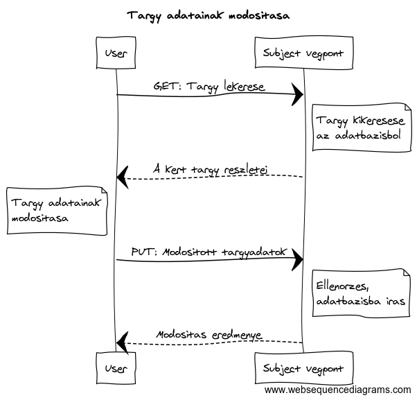
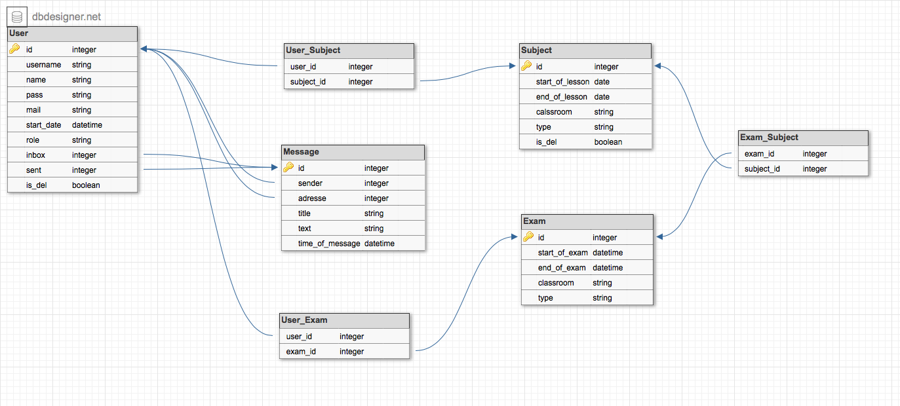

# Alkalmazasok fejlesztese - Neptunusz

## 0. Bevezeto
Ez a program egy felsooktatasi internetes tanulmanyi rendszer.
Lehetoseg van targyak es vizsgak felvetelere, leadasara, valamint egy uzenetkuldo rendszer is az oktatok rendelkezesere all.

### 0.1. Backend
A backend Java Spring Boot technologiaval mukodik, MVC modell szerint fejlesztve.
A frontend a szerveroldalt REST API-n keresztul eri el.

### 0.2. Frontend
TODO::frontend

## 1. Kovetelmenyek

### Funkcionalis kovetelmenyek
 - Regisztracio
 - Bejelentkezes
 - Bejelentkezett felhasznaloknak   
   - Hallgatonak
     - Targy felvetele
     - Targy leadasa
     - Vizsga felvetele
     - Vizsga leadasa
   - Oktatonak
     - Targy letrehozasa
     - Vizsga letrehozasa
     - Hallgato torlese egy targyrol
     - Hallgato torlese egy vizsgarol
     - Hallgato felvetele egy targyra
     - Hallgato felvetele egy vizsgara
   - Minden felhasznalonak
     - Targyak listazasa
     - Vizsgak listazasa
     - Sajat adatok modositasa
     - Sajat uzenetek listazasa
     - Uj uzenet irasa
### Nem funkcionalis kovetelmenyek
 - Felhasznalobarat: Megfeleloen elhatarolt funkciok. Kontrasztos, lathato szinekkel irt betuk.
 - Biztonsag: Jelszoval vedett funkciok. A jelszavak titkositottak.
 - Gyors mukodes: Adatbazisban operalo program, gyors keresessekkel hamar eloallitja a kivant eredmenyeket.

## 2. Tervezes

### 2.1 Oldalterkep
#### Publikus
 - Fooldal
 - TODO::frontend
#### Bejelentkezett Felhasznalo (Hallgato)
 - TODO::frontend
#### Bejelentkezett Felhasznalo (Tanar)
 - TODO::frontend

### 2.2 Vegpontok:
 - Get
   - /exams: Vizsgak listazasa
   - /exams/{id}: Vizsga lekerdezese
   - /messages: Uzenetek listazasa
   - /messages/{id}: Uzenet lekerdezese
   - /subject: Targyak listazasa
   - /subject/{id}: Targy lekerdezese
   - /user: Felhasznalok listazasa
   - /user/{id}: Felhasznalo lekerdezese
 - Post
   - /exams: Vizsga hozzaadasa
   - /messages: Uzenet hozzaadasa
   - /subject: Targy hozzaadasa
   - /user: Felhasznalo hozzaadasa
 - Put
   - /exams/{id}: Vizsga modositasa
   - /messages/{id}: Uzenet modositasa
   - /subject/{id}: Targy modositasa
   - /user/{id}: Felhasznalo modositasa
 - Delete
   - /exams/{id}: Vizsga torlese
   - /messages/{id}: Uzenet torlese
   - /subject/{id}: Targy torlese
   - /user/{id}: Felhasznalo torlese

Egy vegpont leirasa: **Targy adatainak modositasa**


### 2.3 Felhasznalo modell

TODO::frontend

### 2.4 Wireframe

TODO::frontend

### 2.5 Megvalositas

TODO::frontend

## 3. Implementacio

### 3.1 Adatbazisterv


### 3.2 Fejlesztoi kornyezet

Lokalis IDE: SpringToolSuite 4 (STS)
 - Hozzunk letre egy munkakonyvtarat
 - Pulloljuk a githubrol a Neptunusz projektet
 - Telepitsuk a [Lombok](https://projectlombok.org/download) projektet
 - A fejlesztokornyezetbe importaljuk a Neptunusz/backend-et


### 3.3 Konyvtarstruktúra
```
Neptunusz
├───backend
│   ├───src
│   │   └───main
│   │       └───resources
│   │           ├───static
│   │           └───templates
│   └───target
│       ├───classes
│       │   └───hu
│       │       └───elte
│       │           └───Neptunusz
│       │               ├───repositories
│       │               └───security
│       ├───generated-sources
│       │   └───annotations
│       ├───generated-test-sources
│       │   └───test-annotations
│       └───test-classes
│           └───hu
│               └───elte
│                   └───Neptunusz
├───frontend
├───images
└───Neptunusz
    └───src
        ├───main
        │   ├───java
        │   │   └───hu
        │   │       └───elte
        │   │           └───Neptunusz
        │   │               ├───controllers
        │   │               ├───entities
        │   │               ├───repositories
        │   │               └───security
        │   └───resources
        └───test
            └───java
                └───hu
                    └───elte
                        └───Neptunusz
```

## 6. Felhasznaloi dokumentacio

### 6.1 Ajanlott kovetelmenyek
A program barmilyen operacios rendszeren futtathato. Javascript szükseges az oldal hasznalatahoz.
Javasolt bongeszo: Google Chrome vagy Firefox.

### 6.2 Telepites
#### Telepites elott par szukseges lepes
 - NodeJS es npm telepitese : [www.npmjs.com/get-npm](https://www.npmjs.com/get-npm)
 - Internet eleres

#### Telepites
1. Latogasson el a 	[github.com/HeAtNet/Neptunusz](https://github.com/HeAtNet/Neptunusz) oldalra
2. Innen le tudja tolteni ZIP fajlkent, vagy a **https://github.com/HeAtNet/Neptunusz.git** GIT cimmel cloneolhatja.
TODO::frontend

### 6.3 Hasznalata
TODO::frontend
